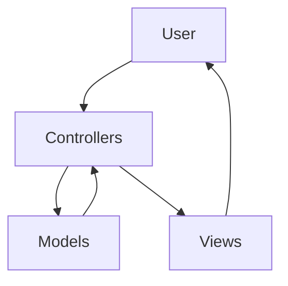
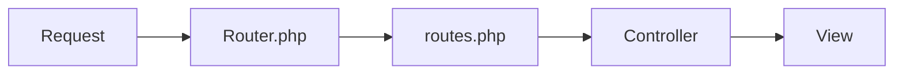
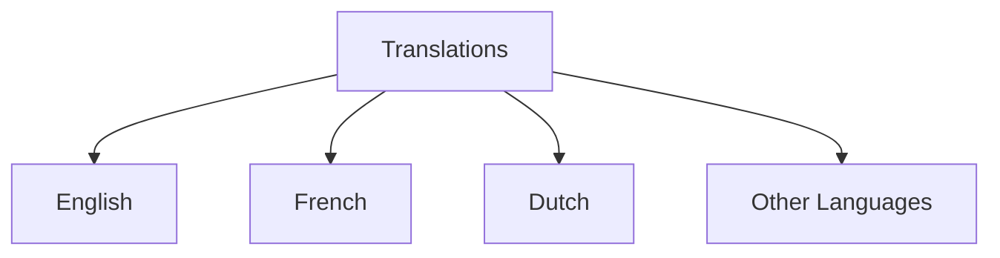
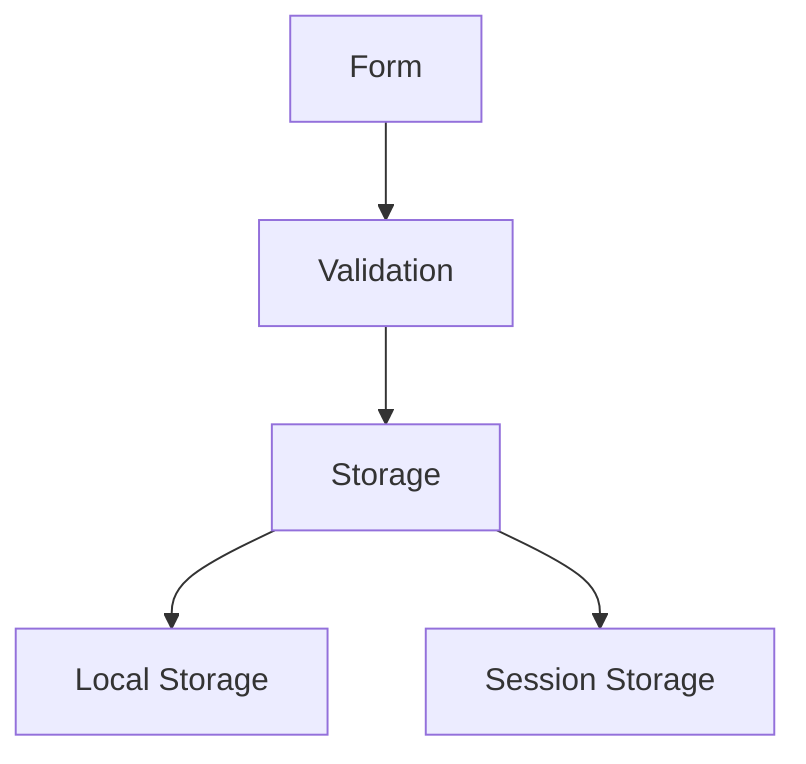
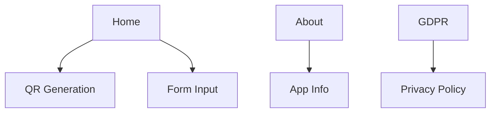

# QR Transfer - Software Design Document

## Table of Contents
1. [Architecture Overview](#1-architecture-overview)
2. [Key Design Principles](#2-key-design-principles)
3. [Page Structure](#3-page-structure)
4. [Development Guidelines](#4-development-guidelines)
5. [Security Considerations](#5-security-considerations)

## 1. Architecture Overview

The application follows the MVC (Model-View-Controller) architecture pattern:



### Components
- **Models** (`/models`)
  - Handle data logic and business rules
  - Manage data persistence
  - Implement business logic

- **Views** (`/views`)
  - Present the UI to users
  - Handle layout and styling
  - Implement responsive design

- **Controllers** (`/controllers`)
  - Process user input
  - Coordinate between Models and Views
  - Handle application flow

## 2. Key Design Principles

### 2.1 Routing System



**Critical Requirements:**
- All routes must be defined in `routes.php`
- Route handling logic must be implemented in `Router.php`
- ⚠️ When adding a new page:
  1. Add route definition to `routes.php`
  2. Update routing logic in `Router.php`

### 2.2 User Interface

#### Desktop Layout
```
+------------------+
|     Header       |
|  Logo     Menu   |
+------------------+
|                  |
|    Main Grid     |
|  +----+ +----+  |
|  |Form| | QR |  |
|  +----+ +----+  |
|                  |
+------------------+
```

#### Mobile Layout
```
+------------------+
| ☰ Logo          |
+------------------+
|                  |
|      Form        |
|                  |
+------------------+
|                  |
|       QR         |
|                  |
+------------------+
```

**Key Features:**
- Header present on all pages (`header.php`)
- Responsive design for:
  - 💻 Desktop: Full layout with right-aligned menu
  - 📱 Mobile (Android/iPhone): Hamburger menu on left
- PicoCSS for consistent styling
- Light background menu

### 2.3 Internationalization



- Location: `/translations` directory
- Format: PHP array files
- Structure:
  ```php
  return [
      'key' => 'translation',
      // ...
  ];
  ```

**Supported Languages:**
The application MUST maintain translations for ALL of the following languages:
1. bg (Bulgarian)
2. cs (Czech)
3. da (Danish)
4. de (German)
5. el (Greek)
6. en (English)
7. es (Spanish)
8. et (Estonian)
9. fi (Finnish)
10. fr (French)
11. ga (Irish)
12. hr (Croatian)
13. hu (Hungarian)
14. it (Italian)
15. lt (Lithuanian)
16. lv (Latvian)
17. mt (Maltese)
18. nl (Dutch)
19. pl (Polish)
20. pt (Portuguese)
21. ro (Romanian)
22. sk (Slovak)
23. sl (Slovenian)
24. sv (Swedish)

⚠️ **Critical**: When updating ANY translation, ALL of the above languages MUST be updated to maintain consistency.

### 2.4 Form Handling



- Client-side validation: `form-validation.js`
- Data persistence:
  - Favorites: Local Storage
  - Form data: Session Storage

### 2.5 QR Code Features

- Generation: Payment information to QR
- Actions:
  - Download QR code
  - Share QR code
- Favorites system

## 3. Page Structure



## 4. Development Guidelines

1. 📱 Responsive Design
   - Test on desktop
   - Test on Android
   - Test on iPhone

2. 🏗️ MVC Pattern
   - Follow separation of concerns
   - Keep controllers thin
   - Use models for business logic

3. 🛣️ Routing
   - Update both routing files
   - Follow existing patterns

4. 🎨 UI Consistency
   - Maintain header across pages
   - Use PicoCSS components
   - Follow responsive patterns

5. 🌐 Internationalization
   - Add translations for all text
   - Test RTL languages
   - Update ALL supported languages when making changes

## 5. Security Considerations

- 🔒 Data Protection
  - No sensitive data in QR codes
  - Essential cookies only
  - GDPR compliance

- 🛡️ Best Practices
  - Input validation
  - XSS prevention
  - CSRF protection

---

*Last updated: 2025-04-04*
