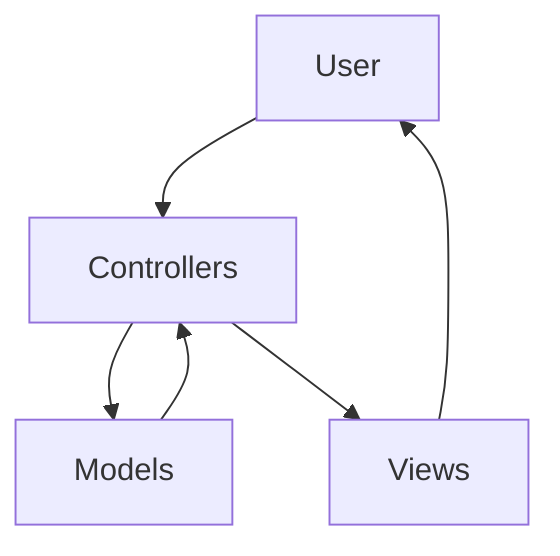
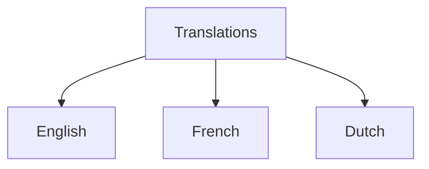
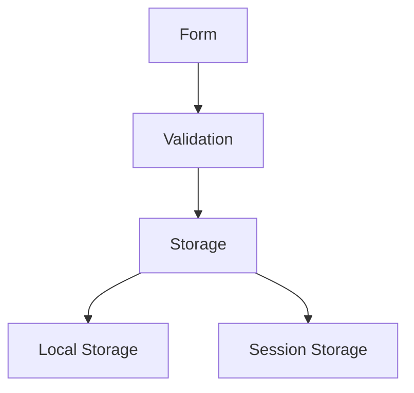
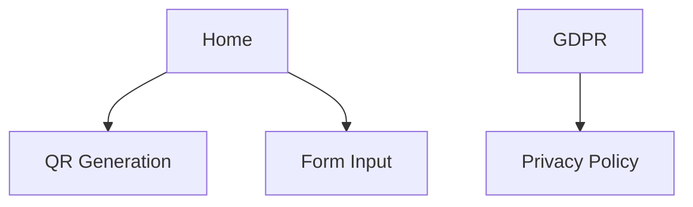

# QR Transfer - Software Design Document

## Table of Contents
1. [Architecture Overview](#1-architecture-overview)
2. [Key Design Principles](#2-key-design-principles)
3. [Page Structure](#3-page-structure)
4. [Development Guidelines](#4-development-guidelines)
5. [Security Considerations](#5-security-considerations)
6. [Translation System](#6-translation-system)
7. [Architecture Changes](#7-architecture-changes)

## 1. Architecture Overview

The application follows the MVC (Model-View-Controller) architecture pattern:



### Components
- **Models** (`/models`)
  - Handle data logic and business rules
  - Manage data persistence
  - Implement business logic

- **Views** (`/views`)
  - Present the UI to users
  - Handle layout and styling
  - Implement responsive design

- **Controllers** (`/controllers`)
  - Process user input
  - Coordinate between Models and Views
  - Handle application flow

## 2. Key Design Principles

### 2.1 Routing System


**Critical Requirements:**
- All routes must be defined in `routes.php`
- Route handling logic must be implemented in `Router.php`
- ⚠️ When adding a new page:
  1. Add route definition to `routes.php`
  2. Update routing logic in `Router.php`

### 2.2 User Interface

#### Desktop Layout
```
+------------------+
|     Header       |
|  Logo     Menu   |
+------------------+
|                  |
|    Main Grid     |
|  +----+ +----+  |
|  |Form| | QR |  |
|  +----+ +----+  |
|                  |
+------------------+
```

#### Mobile Layout
```
+------------------+
| ☰ Logo          |
+------------------+
|                  |
|      Form        |
|                  |
+------------------+
|                  |
|       QR         |
|                  |
+------------------+
```

**Key Features:**
- Header present on all pages (`header.php`)
- Responsive design for:
  - 💻 Desktop: Full layout with right-aligned menu
  - 📱 Mobile (Android/iPhone): Hamburger menu on left
- PicoCSS for consistent styling
- Light background menu

### 2.3 Internationalization



- Location: `/translations` directory
- Format: PHP array files
- Structure:
  ```php
  return [
      'key' => 'translation',
      // ...
  ];
  ```
- Tone: Use informal tone in all languages where such distinction exists (e.g., "tu" instead of "vous" in French, "je/jij" instead of "u" in Dutch)

**Supported Languages:**
1. en (English)
2. fr (French)
3. nl (Dutch)

### 2.4 Form Handling



- Client-side validation: `form-validation.js`
- Data persistence:
  - Favorites: Local Storage
  - Form data: Session Storage

### 2.5 QR Code Features

- Generation: Payment information to QR
- Actions:
  - Download QR code
  - Share QR code
- Favorites system

## 3. Page Structure



## 4. Development Guidelines

1. **CSS Styling**:
   - All CSS must be placed in `/css/styles.css`
   - Avoid inline styles in HTML/PHP files
   - Use CSS variables for theme colors and spacing
   - Follow BEM (Block-Element-Modifier) naming convention for complex components
   - Always prefer PicoCSS components over custom styles when available

2. **PicoCSS Usage**:
   - Use built-in PicoCSS components (buttons, forms, cards etc.) as the foundation
   - Only create custom styles when no suitable PicoCSS component exists
   - When extending PicoCSS, do so through CSS variables where possible
   - Maintain PicoCSS's design language and spacing system

3. 📱 Responsive Design
   - Test on desktop
   - Test on Android
   - Test on iPhone

4. 🏗️ MVC Pattern
   - Follow separation of concerns
   - Keep controllers thin
   - Use models for business logic

5. 🛣️ Routing
   - Update both routing files
   - Follow existing patterns

6. 🎨 UI Consistency
   - Maintain header across pages
   - Use PicoCSS components
   - Follow responsive patterns

7. 🌐 Internationalization
   - Add translations for all text
   - Test RTL languages
   - Update ALL supported languages when making changes

## 5. Security Considerations

- 🔒 Data Protection
  - No sensitive data in QR codes
  - Essential cookies only
  - GDPR compliance

- 🛡️ Best Practices
  - Input validation
  - XSS prevention
  - CSRF protection

## 6. Translation System

### PHP Translations
1. Managed by LanguageController
2. Stored in `/translations/[lang]/` directories
3. Accessed via `$lang->translate('key')` in PHP

### JavaScript Access
1. **Initialization**:
   - `window.t()` function defined in header.php
   - Preloads common translations (save_favorite, update_favorite)
   ```php
   window.t = function(key) {
       const translations = {
           'save_favorite': '<?= $lang->translate('save_favorite') ?>',
           // ...
       };
       return translations[key] || key;
   };
   ```

2. **Usage**:
   - Directly via `window.t('key')`
   - Through the `translate()` module for better abstraction
   ```javascript
   import { translate } from './modules/translations';
   translate('update_favorite');
   ```

3. **Data Attributes**:
   - Some translations passed via HTML data attributes
   ```php
   <button data-update-text="<?= $lang->translate('update_favorite')">
   ```

### Key Locations
- PHP: `LanguageController.php`, view templates
- JS: `modules/translations.js`, component files

## 7. Architecture Changes

### QR Generation Service (Added 2025-04-08)

The QR generation functionality has been extracted from HomeController into a dedicated QRController service.

### Key Changes:
- New QRController handles all QR-related operations
- HomeController now focuses only on homepage rendering
- All existing QR generation endpoints maintained
- Improved separation of concerns

### Methods:
- `generate()` - Main entry point for QR generation
- `lookupBIC()` - Gets BIC code for an IBAN
- `generateEPCData()` - Creates QR code payload
- `generateQRCode()` - Generates visual QR image

### UI and UX Improvements (Added 2025-04-08)

Several enhancements have been made to improve the user interface and experience:

#### Menu and Navigation:
- Consistent text color for menu items
- Hamburger menu icon color matches text color in both light and dark modes
- Mobile menu background properly adapts to theme (light/dark)
- Improved dropdown sizing with dynamic width adaptation
- Enhanced language and theme selectors with consistent styling
- Added hover and focus states for better accessibility
- Added functionality to close the mobile menu when clicking anywhere else on the page

#### Form Interactions:
- IBAN auto-formatting with spaces only on blur (not while typing)
- Removed JavaScript alerts in favor of console logging
- Enhanced favorites management with automatic validation
- Automatic QR code generation when loading favorites
- Improved form validation feedback

#### Visual Consistency:
- Standardized dropdown styling across the application
- Consistent interactive states for form elements
- Improved mobile responsiveness
- Consistent styling in dark mode across all UI elements

#### SEO and Marketing:
- Added comparison table on the "Why Us" page highlighting advantages over other payment solutions
- Added meta tags with descriptions and keywords focusing on concrete use cases
- Implemented structured data markup using JSON-LD for better search engine understanding
- Added Google site verification meta tag

#### Legal Protection:
- Added a disclaimer footer to all pages in all supported languages
- Clarified that QR Transfer is not liable for any financial losses
- Explained that all payments are processed by banks, not QR Transfer

Last updated: 2025-04-08

## Removed Components
- About page (controller, view and route)
- Related menu item

---

*Last updated: 2025-04-08*
