# **iwantto.be Paid** - Software Design Document

## Table of Contents
1. [Architecture Overview](#1-architecture-overview)
2. [Key Design Principles](#2-key-design-principles)
3. [Page Structure](#3-page-structure)
4. [Development Guidelines](#4-development-guidelines)
5. [Security Considerations](#5-security-considerations)
6. [Translation System](#6-translation-system)
7. [Architecture Changes](#7-architecture-changes)
8. [Dependencies](#8-dependencies)
9. [Supported Languages Requirement](#9-supported-languages-requirement)
10. [Internationalization, SEO & Sitemap Maintenance](#10-internationalization-seo--sitemap-maintenance)

## 1. Architecture Overview

The application follows the MVC (Model-View-Controller) architecture pattern:


### Components
- **Models** (`/models`)
  - Handle data logic and business rules
  - Manage data persistence
  - Implement business logic

- **Views** (`/views`)
  - Present the UI to users
  - Handle layout and styling
  - Implement responsive design

- **Controllers** (`/controllers`)
  - Process user input
  - Coordinate between Models and Views
  - Handle application flow

## 2. Key Design Principles

### 2.1 Multi-App Support

The platform supports multiple applications under the iwantto.be umbrella, including Paid!, Involved!, and Driven! Each app is structured to share common components while maintaining unique functionalities.

- **AppRegistry**: Central registry for managing app instances and their lifecycle.
- **Shared Components**: Common utilities and components are stored in the `/shared` directory.
- **App-Specific Logic**: Each app contains its own controllers, views, and models, organized under `/apps/{app_name}`.

### 2.2 Code Organization

- **Directory Structure**:
  - `/controllers`: Handles incoming requests and application logic.
  - `/models`: Manages data and business rules.
  - `/views`: Contains UI templates and presentation logic.
  - `/translations`: Stores language files for internationalization.
  - `/shared`: Contains shared components and utilities.
  - `/apps`: Houses app-specific code for each application.

- **Naming Conventions**:
  - Use PascalCase for class names.
  - Use camelCase for function and variable names.
  - Use snake_case for file and directory names.

### 2.3 Involved! App Functionality

The Involved! app offers interactive event features, such as polls, word clouds, and retrospectives.

- **Polls**: Users can create and participate in polls, with results displayed in real-time.
- **Word Clouds**: Participants can submit words or phrases, which are visualized in a dynamic word cloud.
- **Retrospectives**: Facilitates feedback collection and discussion through structured retrospective sessions.
- **Data Handling**: Ensures compliance with GDPR by automatically deleting event data after one month of inactivity.

### 2.4 Routing System


**Critical Requirements:**
- All routes must be defined in `routes.php`
- Route handling logic must be implemented in `Router.php`
- ⚠️ When adding a new page:
  1. Add route definition to `routes.php`
  2. Update routing logic in `Router.php`

### 2.5 User Interface

#### Desktop Layout
```
+------------------+
|     Header       |
|  Logo     Menu   |
+------------------+
|                  |
|    Main Grid     |
|  +----+ +----+  |
|  |Form| | QR |  |
|  +----+ +----+  |
|                  |
+------------------+
```

#### Mobile Layout
```
+------------------+
| ☰ Logo          |
+------------------+
|                  |
|      Form        |
|                  |
+------------------+
|                  |
|       QR         |
|                  |
+------------------+
```

**Key Features:**
- Header present on all pages (`header.php`)
- Responsive design for:
  - 💻 Desktop: Full layout with right-aligned menu
  - 📱 Mobile (Android/iPhone): Hamburger menu on left
- PicoCSS for consistent styling
- Light background menu

### 2.6 Internationalization



```mermaid
graph TD
    T[Translations] --> EN[English]
    T --> FR[Français]
    T --> NL[Nederlands]
    T --> PL[Polski]
    T --> IT[Italiano]
    T --> ES[Español]
    T --> PT[Português]
    T --> SV[Svenska]
    T --> EL[Ελληνικά]
    T --> RO[Română]
    T --> CS[Čeština]
    T --> HU[Magyar]
    T --> SL[Slovenščina]
    T --> FI[Suomi]
    T --> DA[Dansk]
    T --> NO[Norsk]
    T --> IS[Íslenska]
    T --> LV[Latviešu]
    T --> HR[Hrvatski]
    T --> DE[Deutsch]
```

- Location: `/translations` directory
- Format: PHP array files
- Structure:
  ```php
  return [
      'key' => 'translation',
      // ...
  ];
  ```
- Tone: Use informal tone in all languages where such distinction exists (e.g., "tu" instead of "vous" in French, "je/jij" instead of "u" in Dutch)

**Supported Languages:**
1. en (English)
2. fr (Français)
3. nl (Nederlands)
4. pl (Polski)
5. it (Italiano)
6. es (Español)
7. pt (Português)
8. sv (Svenska)
9. el (Ελληνικά)
10. ro (Română)
11. cs (Čeština)
12. hu (Magyar)
13. sl (Slovenščina)
14. fi (Suomi)
15. da (Dansk)
16. no (Norsk)
17. is (Íslenska)
18. lv (Latviešu)
19. hr (Hrvatski)
20. de (Deutsch)

> The application name is consistently presented as **iwantto.be Paid** in all translations and user-facing content. Any previous references to "QR Transfer" or "Paid!" have been replaced. Unsupported languages (bg, et, ga, lt, mt, sk) are not included.

### 2.7 Form Handling


- Client-side validation: `form-validation.js`
- Data persistence:
  - Favorites: Local Storage
  - Form data: Session Storage

### 2.8 QR Code Features

- Generation: Payment information to QR
- Actions:
  - Download QR code
  - Share QR code
- Favorites system

## 3. Page Structure


## 4. Development Guidelines

1. **CSS Styling**:
   - All CSS must be placed in `/css/styles.css`
   - Avoid inline styles in HTML/PHP files
   - Use CSS variables for theme colors and spacing
   - Follow BEM (Block-Element-Modifier) naming convention for complex components
   - Always prefer PicoCSS components over custom styles when available

2. **PicoCSS Usage**:
   - Use built-in PicoCSS components (buttons, forms, cards etc.) as the foundation
   - Only create custom styles when no suitable PicoCSS component exists
   - When extending PicoCSS, do so through CSS variables where possible
   - Maintain PicoCSS's design language and spacing system

3. 📱 Responsive Design
   - Test on desktop
   - Test on Android
   - Test on iPhone

4. 🏗️ MVC Pattern
   - Follow separation of concerns
   - Keep controllers thin
   - Use models for business logic

5. 🛣️ Routing
   - Update both routing files
   - Follow existing patterns

6. 🎨 UI Consistency
   - Maintain header across pages
   - Use PicoCSS components
   - Follow responsive patterns

7. 🌐 Internationalization
   - Add translations for all text
   - Test RTL languages
   - Update ALL supported languages when making changes

## 5. Security Considerations

- Data is processed securely
- No PII is stored
- Payment info is never stored
- Event data is deleted after one month
- Use HTTPS encryption

## 6. Translation System

- Managed by `LanguageController`
- Translations stored in `/translations`
- Supports multiple languages
- Dynamic language switching

## 7. Architecture Changes

- Updated to support new apps
- Improved translation management
- Enhanced GDPR compliance

## 8. Dependencies

- PHP 8
- PicoCSS
- QR Code library

## 9. Supported Languages Requirement

- All text must be translated
- Maintain consistency across languages

## 10. Internationalization, SEO & Sitemap Maintenance

- Ensure all pages are indexed
- Maintain sitemap
- Optimize for search engines

- Consistent styling in dark mode across all UI elements

#### SEO and Marketing:
- Added comparison table on the "Why Us" page highlighting advantages over other payment solutions
- Added meta tags with descriptions and keywords focusing on concrete use cases

## Removed Components
- About page (controller, view and route)
- Related menu item
- Bulgarian (bg), British English (gb), and Slovak (sk) languages

---

*Last updated: 2025-04-18*
