# **Paid!** - Software Design Document

## Table of Contents
1. [Architecture Overview](#1-architecture-overview)
2. [Key Design Principles](#2-key-design-principles)
3. [Page Structure](#3-page-structure)
4. [Development Guidelines](#4-development-guidelines)
5. [Security Considerations](#5-security-considerations)
6. [Translation System](#6-translation-system)
7. [Architecture Changes](#7-architecture-changes)
8. [Dependencies](#8-dependencies)
9. [Supported Languages Requirement](#9-supported-languages-requirement)

## 1. Architecture Overview

The application follows the MVC (Model-View-Controller) architecture pattern:


### Components
- **Models** (`/models`)
  - Handle data logic and business rules
  - Manage data persistence
  - Implement business logic

- **Views** (`/views`)
  - Present the UI to users
  - Handle layout and styling
  - Implement responsive design

- **Controllers** (`/controllers`)
  - Process user input
  - Coordinate between Models and Views
  - Handle application flow

## 2. Key Design Principles

### 2.1 Routing System


**Critical Requirements:**
- All routes must be defined in `routes.php`
- Route handling logic must be implemented in `Router.php`
- ⚠️ When adding a new page:
  1. Add route definition to `routes.php`
  2. Update routing logic in `Router.php`

### 2.2 User Interface

#### Desktop Layout
```
+------------------+
|     Header       |
|  Logo     Menu   |
+------------------+
|                  |
|    Main Grid     |
|  +----+ +----+  |
|  |Form| | QR |  |
|  +----+ +----+  |
|                  |
+------------------+
```

#### Mobile Layout
```
+------------------+
| ☰ Logo          |
+------------------+
|                  |
|      Form        |
|                  |
+------------------+
|                  |
|       QR         |
|                  |
+------------------+
```

**Key Features:**
- Header present on all pages (`header.php`)
- Responsive design for:
  - 💻 Desktop: Full layout with right-aligned menu
  - 📱 Mobile (Android/iPhone): Hamburger menu on left
- PicoCSS for consistent styling
- Light background menu

### 2.3 Internationalization

```mermaid
graph TD
    T[Translations] --> EN[English]
    T --> FR[Français]
    T --> NL[Nederlands]
    T --> PL[Polski]
    T --> IT[Italiano]
    T --> ES[Español]
    T --> PT[Português]
    T --> SV[Svenska]
    T --> EL[Ελληνικά]
    T --> RO[Română]
    T --> CS[Čeština]
    T --> HU[Magyar]
    T --> SL[Slovenščina]
    T --> FI[Suomi]
    T --> DA[Dansk]
    T --> NO[Norsk]
    T --> IS[Íslenska]
    T --> LV[Latviešu]
    T --> HR[Hrvatski]
    T --> DE[Deutsch]
```



- Location: `/translations` directory
- Format: PHP array files
- Structure:
  ```php
  return [
      'key' => 'translation',
      // ...
  ];
  ```
- Tone: Use informal tone in all languages where such distinction exists (e.g., "tu" instead of "vous" in French, "je/jij" instead of "u" in Dutch)

**Supported Languages:**
1. en (English)
2. fr (Français)
3. nl (Nederlands)
4. pl (Polski)
5. it (Italiano)
6. es (Español)
7. pt (Português)
8. sv (Svenska)
9. el (Ελληνικά)
10. ro (Română)
11. cs (Čeština)
12. hu (Magyar)
13. sl (Slovenščina)
14. fi (Suomi)
15. da (Dansk)
16. no (Norsk)
17. is (Íslenska)
18. lv (Latviešu)
19. hr (Hrvatski)
20. de (Deutsch)

> The application name is consistently presented as **Paid!** in all translations and user-facing content. Any previous references to "QR Transfer" or "iwantto.be" have been replaced. Unsupported languages (bg, et, ga, lt, mt, sk) are not included.

### 2.4 Form Handling


- Client-side validation: `form-validation.js`
- Data persistence:
  - Favorites: Local Storage
  - Form data: Session Storage

### 2.5 QR Code Features

- Generation: Payment information to QR
- Actions:
  - Download QR code
  - Share QR code
- Favorites system

## 3. Page Structure


## 4. Development Guidelines

1. **CSS Styling**:
   - All CSS must be placed in `/css/styles.css`
   - Avoid inline styles in HTML/PHP files
   - Use CSS variables for theme colors and spacing
   - Follow BEM (Block-Element-Modifier) naming convention for complex components
   - Always prefer PicoCSS components over custom styles when available

2. **PicoCSS Usage**:
   - Use built-in PicoCSS components (buttons, forms, cards etc.) as the foundation
   - Only create custom styles when no suitable PicoCSS component exists
   - When extending PicoCSS, do so through CSS variables where possible
   - Maintain PicoCSS's design language and spacing system

3. 📱 Responsive Design
   - Test on desktop
   - Test on Android
   - Test on iPhone

4. 🏗️ MVC Pattern
   - Follow separation of concerns
   - Keep controllers thin
   - Use models for business logic

5. 🛣️ Routing
   - Update both routing files
   - Follow existing patterns

6. 🎨 UI Consistency
   - Maintain header across pages
   - Use PicoCSS components
   - Follow responsive patterns

7. 🌐 Internationalization
   - Add translations for all text
   - Test RTL languages
   - Update ALL supported languages when making changes

## 5. Security Considerations

- 🔒 Data Protection
  - No sensitive data in QR codes
  - Essential cookies only
  - GDPR compliance

- 🛡️ Best Practices
  - Input validation
  - XSS prevention
  - CSRF protection

## 6. Translation System

The **Paid!** application supports the following languages:
- cs (Czech)
- da (Danish)
- de (German)
- el (Greek)
- en (English)
- es (Spanish)
- et (Estonian)
- fi (Finnish)
- fr (French)
- ga (Irish)
- hr (Croatian)
- hu (Hungarian)
- is (Icelandic)
- it (Italian)
- lt (Lithuanian)
- lv (Latvian)
- mt (Maltese)
- nl (Dutch)
- no (Norwegian)
- pl (Polish)
- pt (Portuguese)
- ro (Romanian)
- sl (Slovenian)
- sv (Swedish)

### Translation Consistency
- All supported languages must have up-to-date translation files for every user-facing section, including the "Why Us" page.
- All translation files must refer to the application name as **Paid!** in all languages and contexts, including new and existing translations (see list of supported languages).
- Update the Why Us and GDPR translation files for every supported language when making changes to branding or core features.
- Translation files are organized under `/translations/<lang>/why_us.php`.

### Branding Update

- As of April 18, 2025, the application is branded as **Paid!** throughout all user interfaces, documentation, and translations.
- All references to "QR Transfer" or "iwantto.be" have been replaced with **Paid!**.
- Only supported languages are included in the translation system.

### Branding and Repository Update

- As of April 18, 2025, the application is branded as **Paid!** throughout all user interfaces, documentation, and translations.
- All references to "QR Transfer" or "iwantto.be" have been replaced with **Paid!**.
- Only supported languages are included in the translation system.

### Last updated
- 2025-04-18: Updated translation requirements and branding for "Why Us" page. All supported languages now use the standardized title and branding.

## 7. Architecture Changes

### QR Generation Service (Added 2025-04-08)

The QR generation functionality has been extracted from HomeController into a dedicated QRController service.

### Key Changes:
- New QRController handles all QR-related operations
- HomeController now focuses only on homepage rendering
- All existing QR generation endpoints maintained
- Improved separation of concerns

### Methods:
- `generate()` - Main entry point for QR generation
- `lookupBIC()` - Gets BIC code for an IBAN
- `generateEPCData()` - Creates QR code payload
- `generateQRCode()` - Generates visual QR image

### UI and UX Improvements (Added 2025-04-08)

Several enhancements have been made to improve the user interface and experience:

#### Menu and Navigation:
- Consistent text color for menu items
- Hamburger menu icon color matches text color in both light and dark modes
- Mobile menu background properly adapts to theme (light/dark)
- Improved dropdown sizing with dynamic width adaptation
- Enhanced language and theme selectors with consistent styling
- Added hover and focus states for better accessibility
- Added functionality to close the mobile menu when clicking anywhere else on the page

#### Form Interactions:
- IBAN auto-formatting with spaces only on blur (not while typing)
- Removed JavaScript alerts in favor of console logging
- Enhanced favorites management with automatic validation
- Automatic QR code generation when loading favorites
- Improved form validation feedback

#### Visual Consistency:
- Standardized dropdown styling across the application
- Consistent interactive states for form elements
- Improved mobile responsiveness
- Consistent styling in dark mode across all UI elements

#### SEO and Marketing:
- Added comparison table on the "Why Us" page highlighting advantages over other payment solutions
- Added meta tags with descriptions and keywords focusing on concrete use cases
- Implemented structured data markup using JSON-LD for better search engine understanding
- Added Google site verification meta tag

#### Legal Protection:
- Added a disclaimer footer to all pages in all supported languages
- Clarified that **Paid!** is not liable for any financial losses
- Explained that all payments are processed by banks, not **Paid!**

### Recent Changes (2025-04-14)

1. **Translation Updates**
   - Added missing Romanian form translations
   - Updated GDPR third-party description to include GoQR information
   - Added link to GoQR privacy policy in GDPR documentation

2. **Security Updates**
   - Updated third-party service description in GDPR policy
   - Added specific details about GoQR's data handling practices

### Removal of Unsupported Languages (2025-04-15)

- The list of supported languages has been updated. Bulgarian (bg), British English (gb), and Slovak (sk) are no longer supported. Their translation directories and references have been removed from the codebase.
- The translation system continues to use a main language file referencing modular translation files for each language.
- When removing a language, both its directory and any references in configuration files must be deleted to maintain consistency.

## 8. Dependencies

- The application now depends on [chillerlan/php-qrcode](https://github.com/chillerlan/php-qrcode) for local QR code generation in PHP.
    - This library is managed via Composer and installed in the `vendor/` directory.
    - See `composer.json` for version details.
    - The QR code generation logic was moved from a utility class to the `QRController` for direct integration.

- All previous reliance on remote QR code APIs (such as GoQR) has been removed. QR codes are now generated entirely locally for improved privacy, reliability, and performance.

- Ensure Composer autoloading is included (see `index.php`).

## 9. Supported Languages Requirement

**Requirement:**
Only the languages explicitly listed in `config/languages.php` under `'available_languages'` are supported by the application. No other languages should be referenced, included, or checked for translations. Any translation audit, addition, or update must strictly adhere to this list.

**Current Supported Languages:**
- en (English)
- fr (Français)
- nl (Nederlands)
- pl (Polski)
- it (Italiano)
- es (Español)
- pt (Português)
- sv (Svenska)
- el (Ελληνικά)
- ro (Română)
- cs (Čeština)
- hu (Magyar)
- sl (Slovenščina)
- fi (Suomi)
- da (Dansk)
- no (Norsk)
- is (Íslenska)
- lv (Latviešu)
- hr (Hrvatski)
- de (Deutsch)

To update supported languages, modify the `'available_languages'` array in `config/languages.php` and ensure all translation files reflect this list.

Last updated: 2025-04-18

## Removed Components
- About page (controller, view and route)
- Related menu item
- Bulgarian (bg), British English (gb), and Slovak (sk) languages

---

*Last updated: 2025-04-18*
